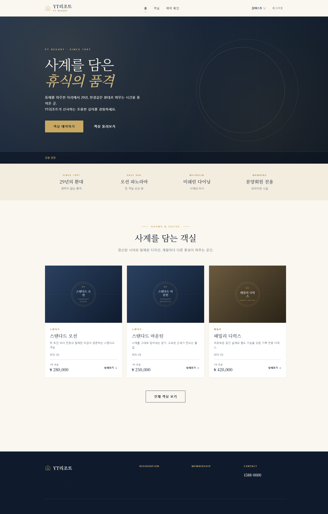
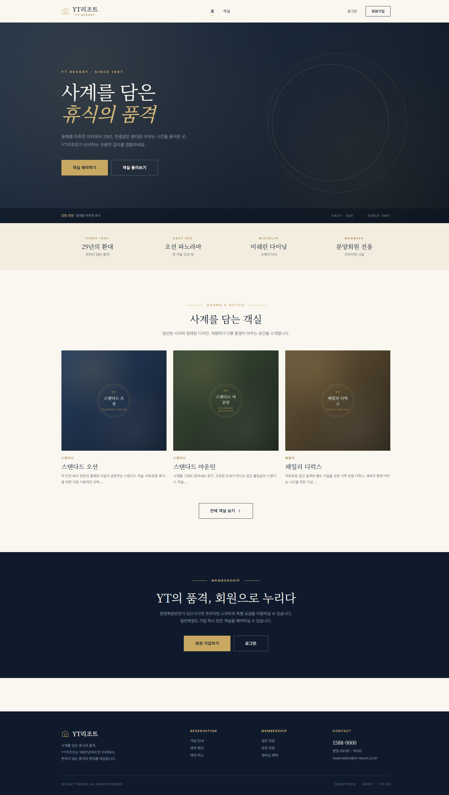
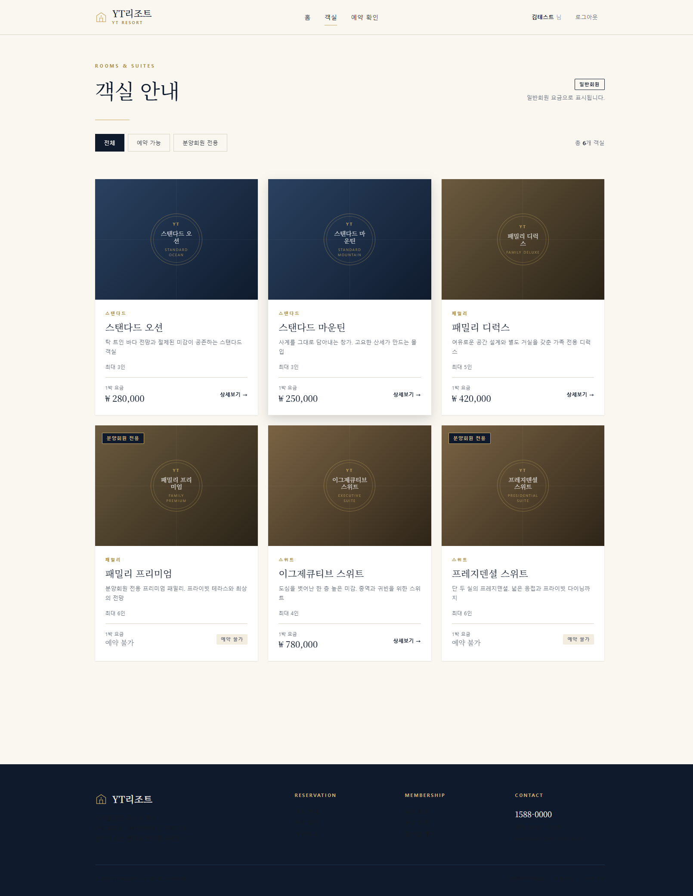
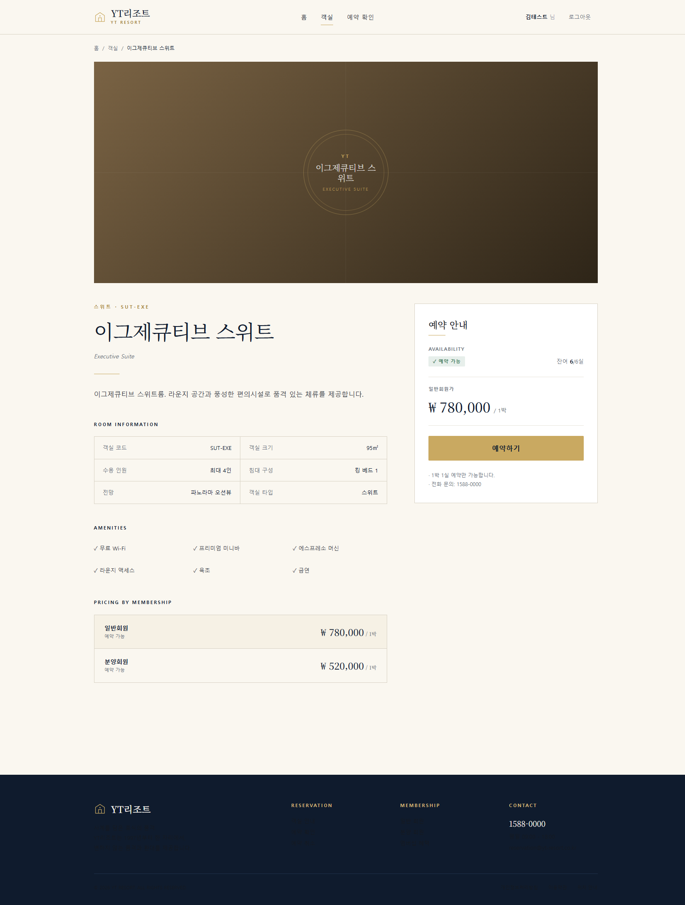
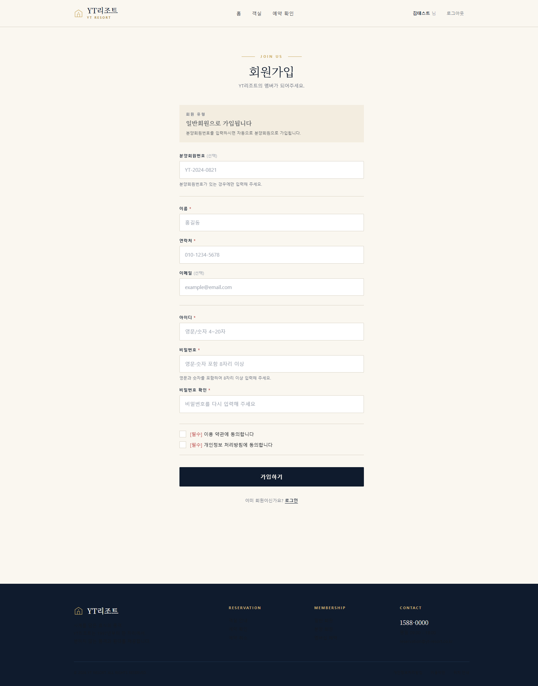
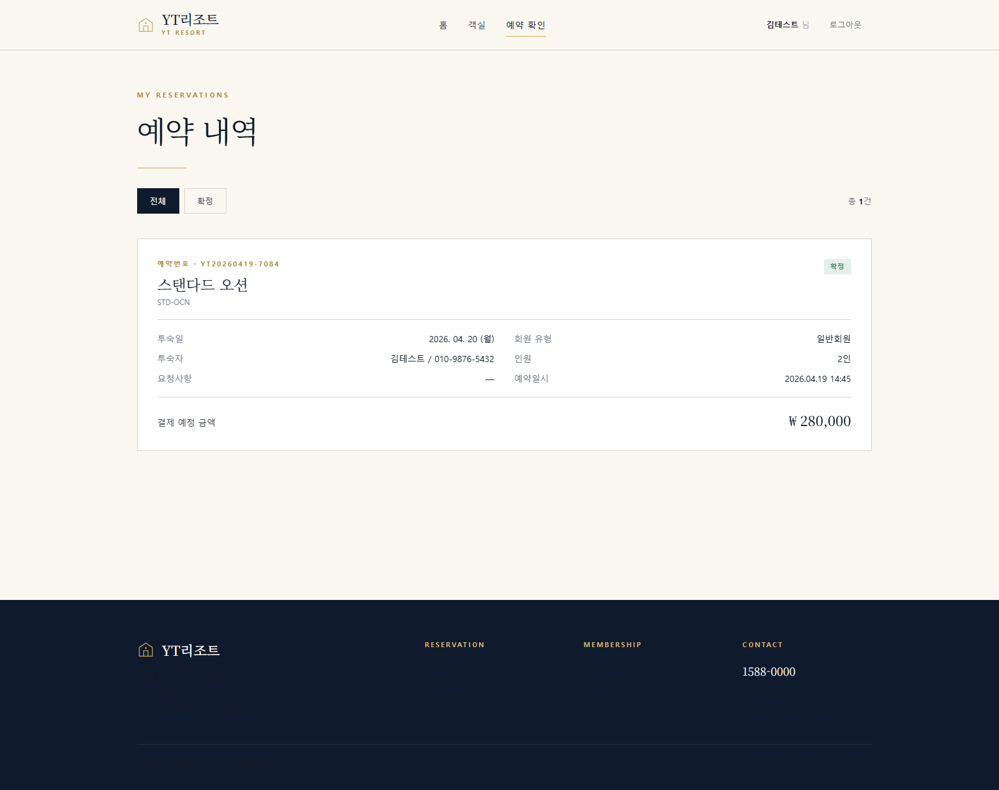

# YT 리조트 예약 시스템

> 사계를 담은 휴식의 품격. 동해를 마주한 자리에서 29년.
>
> 회원가입부터 객실 조회, 1박 1실 예약, 예약 확인까지 이어지는 풀스택 리조트 예약 웹 애플리케이션.

---

## 개요

- **프론트엔드** — Next.js 14 (App Router, TypeScript) · Tailwind CSS · Redux Toolkit · Zod · `middleware.ts` 기반 인증 가드
- **백엔드** — Spring Boot 3.3 · Java 21 · Spring Security + JWT(`username = loginId`) · JPA(`ddl-auto=update`) · Flyway
- **데이터베이스** — PostgreSQL (Neon)
- **인증** — 로그인 시 JWT 발급 → 쿠키(`token`) + localStorage 병행 저장 → 별도 `/api/users/me` 호출로 Redux에 최소 사용자 정보(ID · 이름 · 회원 유형) 저장

### 회원 유형 규칙

| 유형 | 조건 |
|------|------|
| 분양 회원 (`OWNER`) | 분양회원번호 존재 |
| 일반 회원 (`GENERAL`) | 분양회원번호 없음 |

회원 유형에 따라 **예약 가능 객실**과 **객실별 금액**이 달라집니다.

---

## 화면 미리보기

### 메인 (홈)

동해를 마주한 Hero, 29년의 환대를 담은 피처 스트립, 객실 프리뷰 3종을 한 화면에 담았습니다.

<p align="center">
  
</p>

<details>
<summary>Claude Design 프로토타입 대조</summary>

<p align="center">
  
</p>

프로토타입의 화면 구조·색상·타이포를 그대로 유지한 채 Next.js + Tailwind로 이식했습니다.
</details>

---

### 객실 안내

스탠다드 / 패밀리 / 스위트 6개 객실을 회원 유형 기준 예약 가능 여부와 함께 카드 그리드로 제공합니다.

<p align="center">
  
</p>

---

### 객실 상세

객실 정보 · 편의시설 · 회원 유형별 가격표 · 실시간 재고와 예약 CTA를 한 화면에서 확인할 수 있습니다.

<p align="center">
  
</p>

---

### 회원가입

분양회원번호 유무로 회원 유형이 자동 결정됩니다. 비밀번호는 영문+숫자 포함 8자리 이상, 클라이언트 Zod · 서버 `@Pattern`이 동일 규칙을 공유합니다.

<p align="center">
  
</p>

---

### 예약 내역

로그인한 본인 예약만 조회됩니다. 예약번호는 `YTYYYYMMDD-XXXX` 형식으로 발급됩니다.

<p align="center">
  
</p>

---

## 주요 기능

| # | 기능 | 설명 |
|---|------|------|
| 1 | 회원가입 | 아이디 중복 / 비밀번호 규칙 / 연락처 형식 검증. 분양회원번호 유무로 `OWNER`/`GENERAL` 자동 분류 |
| 2 | 로그인 | JWT 발급 · 쿠키 저장 · `/api/users/me`로 최소 사용자 정보를 Redux에 주입 |
| 3 | 객실 조회 | 6개 Mock 객실, 회원 유형별 가격/예약 가능 여부 표시 |
| 4 | 예약 | 1박 1실. 회원 유형 적합성 + 재고 검증 7단계, `PESSIMISTIC_WRITE` 락으로 동시성 보호 |
| 5 | 예약 확인 | 본인 예약만 조회 (JWT `sub` 기반 필터링) |
| 6 | 권한 라우팅 | `middleware.ts`가 `/booking/*`, `/reservations/*`를 보호. 미로그인 시 `/login?returnTo=...` 리다이렉트 |

---

## 디렉터리 구조

```
apps/
  web/          # Next.js 프론트엔드
    src/
      app/            # App Router 페이지
      components/     # Header · Footer · RoomCard · RoomPlaceholder
      hooks/          # useRooms · useRoom · useReservations
      lib/            # schemas (Zod) · api.ts · auth.ts
      store/          # Redux Toolkit (auth · user slice)
      middleware.ts   # 인증 가드
  api/          # Spring Boot 백엔드
    src/main/java/com/ytresort/api/
      auth/           # signup · login
      user/           # GET /api/users/me
      room/           # 객실 조회
      reservation/    # 예약 생성 · 조회
      security/       # JWT 필터 · SecurityConfig
      common/         # 공통 예외 · 에러 응답
    src/main/resources/
      application.yml               # 외부 주입 가능한 DB/JWT 설정
      db/migration/V1_1~V1_4.sql    # Flyway

_workspace/
  00_input.md                  # 요구사항 요약
  01_architect_*.md            # 설계 문서 4종
  02_frontend_report.md
  02_backend_report.md
  03_qa_report.md              # 최종 QA (28 pass / 0 fail)
  screenshots/                 # 이 README에 쓰인 캡처
```

---

## 실행 방법

### 백엔드

```bash
cd apps/api
./gradlew bootRun
```

`application.yml`의 DB 접속 정보와 JWT secret은 아래 환경 변수로 외부 주입할 수 있습니다.

```
SPRING_DATASOURCE_URL
SPRING_DATASOURCE_USERNAME
SPRING_DATASOURCE_PASSWORD
APP_JWT_SECRET
APP_CORS_ALLOWED_ORIGINS
```

부팅 시 Flyway가 `V1_1~V1_4` 마이그레이션을 적용하고 6개 객실 시드를 삽입합니다.

### 프론트엔드

```bash
cd apps/web
npm install
npm run dev
```

`http://localhost:3000` 에서 접속. `/api/*` 요청은 `next.config.mjs`의 rewrites로 `NEXT_PUBLIC_API_BASE_URL`(기본 `http://localhost:8080`) 백엔드에 프록시됩니다.

---

## 품질 지표

- QA 최종: **28 pass · 0 fail · 2 minor (해소됨) · 3 warning**
- `tsc --noEmit`, `next build` 통과
- 콘솔 에러 0건 (favicon 404 제외, 기능 영향 없음)
- API 경계면 FE Zod ↔ BE DTO 1:1 일치 검증 완료 (`_workspace/03_qa_report.md` 참조)

---

## Claude Code 채팅 방법

### `webapp-orchestrator` 스킬 사용
```
`webapp-orchestrator` 스킬을 사용해서 프런트엔드와 백엔드를 모두 구현해줘.
PRD 문서는 `docs/prd/yt_resort.md`를 참고하면 되고, 
`docs/prototype/yt_resort/index.html`에 localStorage 기반으로 동작하는 프로토타입 HTML 파일이 있으니 
이 UI를 그대로 기준으로 구현하면 된다. 해당 프로토타입은 Claude Design으로 만든 것이므로 화면 구조와 흐름을 동일하게 유지해줘.

프런트엔드는 Next.js(Typescript)와 Tailwind CSS 기반으로 구성하고, 
전역 상태 관리는 Redux를 사용해줘. 
백엔드 API와의 데이터 검증은 Zod를 활용해서 타입 안정성을 보장해줘. 
로그인 이후에는 사용자 정보를 Redux 전역 상태에 저장하고, 
화면에서 ‘~~님’과 같이 표시할 때 필요한 최소한의 정보(예: ID, 이름 등)만 유지하도록 해줘.
 이 정보는 별도의 사용자 정보 조회 API를 통해 가져오도록 구현해줘.

라우팅 시에는 middleware.ts를 사용해서 인증이 필요한 페이지에 대한 접근을 제어해줘. 
인증되지 않은 사용자는 해당 페이지에 접근할 수 없도록 처리해줘.

백엔드는 Spring Boot와 Gradle 기반으로 구성하고, 데이터베이스는 PostgreSQL을 사용해줘. 
application.yml에는 DB 접속 정보를 직접 입력할 수 있도록 비워두거나 외부 설정이 가능하도록 구성해줘. 
ORM은 JPA를 사용해서 테이블이 없을 경우 자동 생성되도록 설정하고, 
동시에 DB 스키마 버전 관리를 위해 Flyway를 반드시 적용해줘.

인증은 JWT 기반으로 구현하고 Spring Security를 사용해줘. 
이때 username 필드에는 회원 ID(로그인 ID)를 사용해서 인증 및 인가 처리를 하도록 해줘. 
전체적으로는 로그인 시 JWT를 발급받고, 프런트엔드에서는 이를 저장한 뒤 요청 시 활용하며, 
백엔드는 해당 토큰을 검증해서 사용자 권한을 처리하는 구조로 구현해줘.
```

### E2E (End to End) 테스트 및 디버깅

```
application.yml 파일에 db 접속정보 입력했고, 
prototype 소스도 vs code - live server 띄워서 
`http://127.0.0.1:5500/docs/prototype/yt_resort/index.html`로 확인 가능해. 

chrome claude code 확장 프로그램 설치 되어있으니까
backend, frontend 사용중인 포트는 너가 알아서 죽여가면서
서버를 너가 알아서 띄우면서 모든 페이지 테스트하면서 다른 부분이나 버그/콘솔에러 등 모두 디버깅 진행해줘

혹시 db 접속 정보 잘못 입력해서 db 연결 안되면 다시 알려주고!
```

